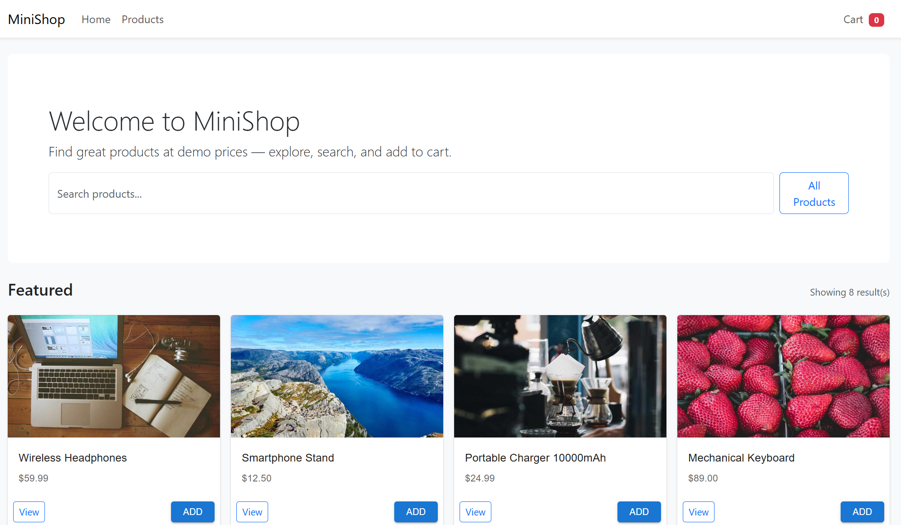

# E-Commerce SPA Case Study

A comprehensive demonstration of Single Page Application (SPA) architecture with two implementations:

1. **Vanilla JS SPA** — Pure JavaScript, HTML, CSS
2. **React + Vite SPA** — Modern React with component-based design (recommended)

Both showcase core SPA concepts: client-side routing, state management, responsive design, and persistent cart functionality using localStorage.

---

## Quick Start

### Vanilla JS (Root Directory)
```bash
npm install
npm run start
# Open http://localhost:8080
```

### React + Vite (Recommended)
```bash
cd react-app
npm install
npm run dev
# Open http://localhost:5173 (or displayed port)
```

---

## Screenshots

### Home Page

*Interactive home with search and featured products*

### Product Catalog

*Browse all products in responsive grid layout*

### Product Details

*Detailed product information page*

### Shopping Cart

*Cart with quantity controls and real-time totals*

### Checkout

*Order form and confirmation flow*

---

## Features

✅ **Interactive Home** — Search & featured products  
✅ **Product Catalog** — Browse all products  
✅ **Product Details** — Full product information  
✅ **Shopping Cart** — Add/remove/update items  
✅ **Cart Persistence** — Data saved in localStorage  
✅ **Checkout Flow** — Demo order placement  
✅ **Responsive Design** — Mobile-first Bootstrap layout  
✅ **Client-Side Routing** — Fast navigation without reloads  
✅ **Real-Time Calculations** — Instant total updates  

---

## Project Structure

```
case_study/
├── index.html              # Vanilla SPA entry
├── src/
│   ├── app.js             # Router, state, logic
│   ├── styles.css         # Styles
│   └── api/products.json  # Product data
├── package.json
├── README.md
└── react-app/             # React implementation
    ├── src/
    │   ├── App.jsx
    │   ├── components/
    │   ├── context/CartContext.jsx
    │   └── data/products.json
    ├── vite.config.js
    └── package.json
```

---

## Technology Stack

**Vanilla SPA:**
- HTML5, CSS3, JavaScript (ES6+)
- Bootstrap 5, Material Icons
- Hash-based routing, localStorage

**React SPA:**
- React 18, React Router 6
- Vite 5 (build tool)
- Bootstrap 5, Material UI 5
- Context API for state

---


